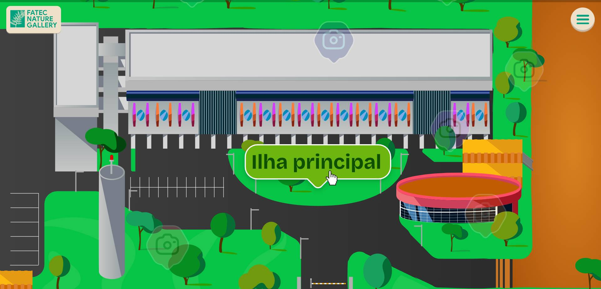

<div align="center">


# 🌿 Fatec Nature Gallery

### Galeria Interativa da Natureza da Fatec Dom Amaury Castanho

Projeto desenvolvido para celebrar o **Dia Mundial do Meio Ambiente**, permitindo a exploração visual da fauna, flora e paisagens da instituição através de uma experiência moderna, acessível e interativa.




</div>

---

## 📋 Sumário

* [Sobre o Projeto](#-sobre-o-projeto)
* [Funcionalidades](#-funcionalidades)
* [Tecnologias Utilizadas](#-tecnologias-utilizadas)
* [Design e IHC](#-design-e-ihc)
* [Fluxo de Navegação](#-fluxo-de-navegação)
* [Instalação](#-instalação)
* [Estrutura do Projeto](#-estrutura-do-projeto)
* [Autor](#-autor)

---

## 🌱 Sobre o Projeto

O **Fatec Nature Gallery** é uma plataforma web desenvolvida para apresentar e valorizar os espaços naturais da **Fatec Dom Amaury Castanho**.

A aplicação permite que visitantes explorem diferentes áreas da instituição por meio de um **mapa interativo**, acessando galerias de fotografias organizadas por localização.

O projeto combina recursos modernos de desenvolvimento web, acessibilidade e design centrado no usuário para proporcionar uma experiência intuitiva e agradável.

---

## ✨ Funcionalidades

### 🗺️ Mapa Interativo

* Navegação visual pelos ambientes da Fatec.
* Identificação rápida dos pontos de interesse.
* Acesso direto às galerias de cada local.

### 📸 Galeria de Imagens

* Visualização organizada por áreas.
* Navegação entre fotografias.
* Modo tela cheia com Lightbox.

### 🎉 Experiência Interativa

* Animações suaves utilizando GSAP.
* Curtidas em imagens.
* Efeitos visuais com Confetti.

### 📬 Formulário de Contato

* Envio de mensagens via EmailJS.
* Integração com redes sociais.

### 📱 Responsividade

* Compatível com dispositivos móveis.
* Interface adaptável para diferentes tamanhos de tela.

---

## 🚀 Tecnologias Utilizadas

| Tecnologia        | Finalidade              |
| ----------------- | ----------------------- |
| React 19          | Interface do usuário    |
| TypeScript        | Tipagem estática        |
| Vite              | Build e desenvolvimento |
| React Router DOM  | Navegação entre páginas |
| GSAP              | Animações               |
| Lightbox.js React | Visualização de imagens |
| Canvas Confetti   | Efeitos visuais         |
| EmailJS           | Envio de formulários    |
| React Icons       | Biblioteca de ícones    |

---

## 🎨 Design e IHC

### Usabilidade

* Navegação simplificada através de menu hambúrguer.
* Fluxo intuitivo de exploração:

```text
Início
   ↓
Mapa
   ↓
Local
   ↓
Galeria
```

* Feedback visual para ações do usuário.
* Transições suaves entre páginas.

### Acessibilidade

* Uso de atributos ARIA:

  * `aria-label`
  * `aria-expanded`
  * `aria-hidden`
  * `aria-busy`

* Navegação por teclado.

* Estados visuais de foco e interação.

* Formulários semanticamente estruturados.

### Design Visual

* Layout responsivo.
* Priorização das fotografias.
* Interface limpa e moderna.
* Paleta visual inspirada em elementos naturais.

---

## 🧭 Fluxo de Navegação

### 1️⃣ Página Inicial

Conheça a proposta do projeto e inicie a experiência.

### 2️⃣ Exploração do Mapa

* Visualize os pontos de interesse.
* Descubra os locais fotografados.
* Selecione uma área para acessar sua galeria.

### 3️⃣ Galeria

* Navegue entre as imagens.
* Amplie fotografias em tela cheia.
* Interaja com os conteúdos.

### 4️⃣ Contato

* Envie mensagens pelo formulário.
* Acesse as redes sociais do projeto.

---

## 📂 Estrutura do Projeto

```text
src/
├── assets/
├── components/
├── pages/
├── routes/
├── styles/
├── data/
└── App.tsx

public/
├── logo.svg
├── banner.jpg
└── images/
```

---

## ⚙️ Instalação

### Clonar o repositório

```bash
git clone https://github.com/SEU-USUARIO/fatec-nature-gallery.git
```

### Acessar o diretório

```bash
cd fatec-nature-gallery
```

### Instalar dependências

```bash
npm install
```

### Executar em desenvolvimento

```bash
npm run dev
```

### Gerar build de produção

```bash
npm run build
```

---

## 👨‍💻 Autor

### Carlos Mattei

* LinkedIn: https://www.linkedin.com/in/carlos-henrique-b46826340
* GitHub: https://github.com/CarlosMattei
* Instagram: https://www.instagram.com/carlosmattei.16

---

<div align="center">

### 🌿 Fatec Nature Gallery

Preservando e divulgando a beleza natural da Fatec Dom Amaury Castanho através da tecnologia.

</div>
